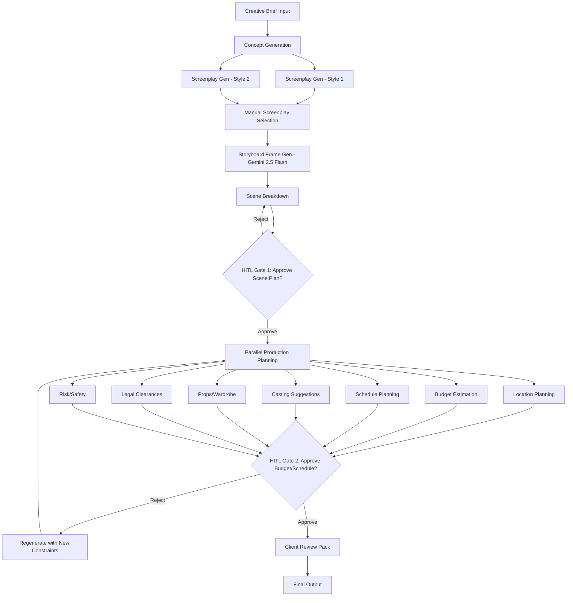

# Design Document: Ad Production Multi-Agent System

## Overview

This design extends the existing LangGraph-based ad video generation pipeline to produce production-ready artifacts for advertisement shoots. The system preserves the creative chain (concept → screenplays → storyboard) and adds a comprehensive production planning layer that generates shotlists, location plans, budgets, schedules, crew/gear suggestions, legal checklists, and risk registers. This system explicitly removes video generation and focuses on pre-production planning.

**Key Design Principles:**
- Preserve existing creative chain nodes without modification
- Remove all video generation functionality (Veo 3.1, FFmpeg)
- Use Gemini 2.5 Flash for storyboard frames (already implemented)
- Add structured scene breakdown with strict JSON schema
- Implement parallel production planning nodes for efficiency
- Include human-in-the-loop gates at critical decision points
- Support regeneration with changed constraints without redoing storyboard
- Export artifacts in multiple formats (markdown, JSON, CSV, PDF)

## Architecture

### High-Level Pipeline Flow



### LangGraph State Extension

The existing State TypedDict will be extended to support production planning:

```python
from typing import TypedDict, Annotated, List, Dict, Optional
import operator

class Shot(TypedDict):
    shot_id: str
    scene_id: str
    shot_type: str  # "WIDE", "MEDIUM", "CLOSE-UP", "INSERT", "POV"
    camera_movement: str  # "STATIC", "PAN", "TILT", "DOLLY", "STEADICAM"
    duration_sec: float
    description: str

class SceneDetail(TypedDict):
    scene_id: str
    duration_sec: float
    location_type: str  # "INT" or "EXT"
    time_of_day: str  # "DAY" or "NIGHT"
    location_description: str
    cast_count: int
    props: List[str]
    wardrobe: List[str]
    sfx_vfx: List[str]
    dialogue_vo: str
    on_screen_text: str

class ScenePlan(TypedDict):
    scenes: List[SceneDetail]
    shots: List[Shot]

class LocationRequirement(TypedDict):
    location_id: str
    location_type: str  # "INT" or "EXT"
    description: str
    key_features: List[str]
    accessibility_requirements: str
    power_requirements: str
    space_requirements: str
    alternates: List[str]

class LocationsPlan(TypedDict):
    locations: List[LocationRequirement]
    permits_required: List[str]
    noise_restrictions: bool
    time_restrictions: str
    parking_availability: str
    insurance_requirements: str

class BudgetLineItem(TypedDict):
    category: str
    item: str
    quantity: int
    unit_cost: float
    total_cost: float
    assumptions: str

class BudgetEstimate(TypedDict):
    total_min: float
    total_max: float
    line_items: List[BudgetLineItem]
    cost_drivers: List[str]
    contingency_percent: float

class ScheduleDay(TypedDict):
    day_number: int
    date: Optional[str]
    location: str
    scenes: List[str]  # scene_ids
    setup_time_hours: float
    shoot_time_hours: float
    company_move_time_hours: float
    notes: str

class SchedulePlan(TypedDict):
    total_shoot_days: int
    schedule_days: List[ScheduleDay]
    assumptions: List[str]

class CrewMember(TypedDict):
    role: str
    responsibilities: str
    required: bool  # True for minimum viable, False for upgrades

class EquipmentItem(TypedDict):
    item: str
    quantity: int
    required: bool  # True for minimum viable, False for upgrades

class CrewGearPackage(TypedDict):
    crew: List[CrewMember]
    equipment: List[EquipmentItem]

class LegalItem(TypedDict):
    category: str  # "talent_release", "location_release", "trademark", "music", etc.
    description: str
    required: bool
    high_risk: bool

class LegalClearanceReport(TypedDict):
    items: List[LegalItem]
    minors_involved: bool
    drone_permits_required: bool

class Risk(TypedDict):
    risk_id: str
    category: str  # "safety", "weather", "night_shoot", "stunt", "crowd", "equipment"
    description: str
    likelihood: str  # "LOW", "MEDIUM", "HIGH"
    impact: str  # "LOW", "MEDIUM", "HIGH"
    mitigation_strategy: str

class RiskRegister(TypedDict):
    risks: List[Risk]

class State(TypedDict):
    # Existing fields (preserved from creative chain)
    theme: str
    concept: str
    screenplay_1: str
    screenplay_2: str
    screenplay_winner: str
    story_board: str
    storyboard_frames: List[StoryboardFrame]
    overall_status: Annotated[str, operator.add]
    
    # New fields for production planning
    creative_brief: CreativeBrief
    scene_plan: ScenePlan
    locations_plan: LocationsPlan
    budget_estimate: BudgetEstimate
    schedule_plan: SchedulePlan
    casting_suggestions: Dict
    props_wardrobe_list: Dict
    legal_clearance_report: LegalClearanceReport
    risk_register: RiskRegister
    production_pack: str  # Path to final markdown/PDF
```

## Components and Interfaces

### 1. Preserved Creative Chain Nodes

**Purpose:** Maintain existing concept, screenplay, and storyboard generation

**Preserved Nodes:**
- `ad_concept_creation_node`: Generate concept from theme
- `screen_play_creation_node_1`: Generate Rajamouli-style screenplay
- `screen_play_creation_node_2`: Generate Shankar-style screenplay
- `screenplay_evaluation_node`: Manual human selection of winning screenplay
- `story_board_creation_node`: Generate storyboard frames with Gemini 2.5 Flash

**Implementation Notes:**
- These nodes are preserved exactly as they exist in the current pipeline
- No modifications to prompts, logic, or interfaces
- Gemini 2.5 Flash is already used for storyboard frames (not DALLE-3)

### 2. Scene Breakdown Node

**Purpose:** Convert storyboard into structured scene plan with strict JSON schema

**Interface:**
```python
def scene_breakdown_node(state: State) -> Dict:
    """
    Break down storyboard into structured scene plan with shots.
    
    Args:
        state: Current pipeline state with storyboard_frames
        
    Returns:
        Dict containing 'scene_plan' key with ScenePlan
    """
```

**Implementation Notes:**
- Use LLM with structured output to generate scene plan
- Enforce strict JSON schema validation
- For each scene, generate 2-5 shots depending on complexity
- Validate sum of shot durations equals scene duration (±1 second)
- Extract location types (INT/EXT), time of day (DAY/NIGHT), cast count, props, wardrobe, SFX/VFX from storyboard descriptions
- Generate unique scene_id and shot_id for each element

**Prompt Template:**
```
You are a production planning specialist. Convert the following storyboard into a detailed scene plan.

Storyboard:
{storyboard_frames}

Brand: {brand_name}
Target Duration: {target_duration_sec} seconds

Generate a scene plan in strict JSON format:
{
  "scenes": [
    {
      "scene_id": "S001",
      "duration_sec": 5.0,
      "location_type": "INT" or "EXT",
      "time_of_day": "DAY" or "NIGHT",
      "location_description": "Detailed location description",
      "cast_count": 2,
      "props": ["prop1", "prop2"],
      "wardrobe": ["costume1", "costume2"],
      "sfx_vfx": ["effect1"],
      "dialogue_vo": "Dialogue or voiceover text",
      "on_screen_text": "Text overlay"
    }
  ],
  "shots": [
    {
      "shot_id": "S001_001",
      "scene_id": "S001",
      "shot_type": "WIDE" | "MEDIUM" | "CLOSE-UP" | "INSERT" | "POV",
      "camera_movement": "STATIC" | "PAN" | "TILT" | "DOLLY" | "STEADICAM",
      "duration_sec": 2.5,
      "description": "Detailed shot description"
    }
  ]
}

Requirements:
- Each scene must have 2-5 shots
- Sum of shot durations must equal scene duration (±1 second)
- Use standard shot types and camera movements
- Include all props, wardrobe, and effects visible in storyboard
```

### 3. Scene Plan Approval Gate (HITL)

**Purpose:** Allow human review and approval of scene plan before cost estimation

**Interface:**
```python
def scene_plan_approval_gate(state: State) -> Dict:
    """
    Display scene plan for human approval.
    
    Args:
        state: Current pipeline state with scene_plan
        
    Returns:
        Dict with 'approved' (bool) and optional 'modifications' (dict)
    """
```

**Implementation Notes:**
- Display scene_plan.json in readable format
- Show summary statistics: total scenes, total shots, total duration, location breakdown
- Prompt user for approval or rejection
- If rejected, allow user to specify modifications (e.g., "reduce cast count in scene 3")
- If approved, proceed to parallel production planning nodes

### 4. Location Planning Node

**Purpose:** Generate location requirements, alternates, and permit checklists

**Interface:**
```python
def location_planning_node(state: State) -> Dict:
    """
    Generate location planning document.
    
    Args:
        state: Current pipeline state with scene_plan
        
    Returns:
        Dict containing 'locations_plan' key with LocationsPlan
    """
```

**Implementation Notes:**
- Extract unique locations from scene_plan
- For each location, generate requirements based on scene details
- Suggest 2-3 alternate locations for each primary location
- Generate permit checklist based on location types and activities
- Consider accessibility, power, space, parking, noise restrictions
- Export as both markdown and JSON

**Prompt Template:**
```
You are a location scout. Generate location requirements for the following scenes.

Scene Plan:
{scene_plan}

For each unique location, provide:
1. Primary location requirements (type, description, key features)
2. Accessibility, power, and space requirements
3. 2-3 alternate location suggestions
4. Permit and constraint checklist

Output in JSON format matching LocationsPlan schema.
```

### 5. Budget Estimation Node

**Purpose:** Generate detailed budget estimate with line items and assumptions

**Interface:**
```python
def budgeting_node(state: State) -> Dict:
    """
    Generate budget estimate.
    
    Args:
        state: Current pipeline state with scene_plan
        
    Returns:
        Dict containing 'budget_estimate' key with BudgetEstimate
    """
```

**Implementation Notes:**
- Calculate budget based on scene complexity, location count, cast count, shoot days
- Include line items for: crew (by role), equipment rental, location fees, talent/casting, props/wardrobe, post-production, insurance, contingency (10-15%)
- Provide min/max range for each line item
- Include explicit assumptions (e.g., "Assumes 10-hour shoot days", "Assumes local crew rates")
- Identify cost drivers (factors that significantly impact budget)
- Export as both markdown and CSV

**Budget Calculation Logic:**
```python
def estimate_budget(scene_plan: ScenePlan) -> BudgetEstimate:
    # Base crew cost (director, DP, AD, sound, etc.)
    crew_cost = calculate_crew_cost(scene_plan)
    
    # Equipment rental (camera, lighting, grip, sound)
    equipment_cost = calculate_equipment_cost(scene_plan)
    
    # Location fees (based on location types and shoot days)
    location_cost = calculate_location_cost(scene_plan)
    
    # Talent/casting (based on cast count and shoot days)
    talent_cost = calculate_talent_cost(scene_plan)
    
    # Props and wardrobe
    props_wardrobe_cost = calculate_props_wardrobe_cost(scene_plan)
    
    # Post-production (editing, color, sound mix)
    post_cost = calculate_post_production_cost(scene_plan)
    
    # Insurance (based on total budget)
    insurance_cost = (crew_cost + equipment_cost + location_cost) * 0.05
    
    # Contingency (10-15%)
    contingency = (crew_cost + equipment_cost + location_cost + talent_cost + props_wardrobe_cost + post_cost + insurance_cost) * 0.125
    
    total_min = sum of all min values
    total_max = sum of all max values
    
    return BudgetEstimate with line items and assumptions
```

### 6. Schedule Planning Node

**Purpose:** Generate shoot schedule with days, company moves, and setup times

**Interface:**
```python
def schedule_ad_node(state: State) -> Dict:
    """
    Generate shoot schedule.
    
    Args:
        state: Current pipeline state with scene_plan
        
    Returns:
        Dict containing 'schedule_plan' key with SchedulePlan
    """
```

**Implementation Notes:**
- Group scenes by location to minimize company moves
- Estimate setup time based on scene complexity (lighting, props, etc.)
- Estimate shoot time based on shot count and complexity
- Include company move time between locations (1-3 hours depending on distance)
- Assume 10-12 hour shoot days
- Export as both markdown and CSV

**Scheduling Algorithm:**
```python
def generate_schedule(scene_plan: ScenePlan) -> SchedulePlan:
    # Group scenes by location
    scenes_by_location = group_scenes_by_location(scene_plan)
    
    schedule_days = []
    current_day = 1
    
    for location, scenes in scenes_by_location.items():
        # Estimate setup time (0.5-2 hours depending on complexity)
        setup_time = estimate_setup_time(scenes)
        
        # Estimate shoot time (0.5-1 hour per scene)
        shoot_time = estimate_shoot_time(scenes)
        
        # If total time > 10 hours, split across multiple days
        if setup_time + shoot_time > 10:
            # Split scenes across multiple days
            days = split_scenes_across_days(scenes, max_hours=10)
            for day_scenes in days:
                schedule_days.append(create_schedule_day(current_day, location, day_scenes))
                current_day += 1
        else:
            schedule_days.append(create_schedule_day(current_day, location, scenes))
            current_day += 1
        
        # Add company move time if changing locations
        if not is_last_location:
            schedule_days[-1]['company_move_time_hours'] = 2.0
    
    return SchedulePlan(total_shoot_days=current_day-1, schedule_days=schedule_days)
```

### 7. Casting Suggestions Node

**Purpose:** Generate casting recommendations based on scene requirements

**Interface:**
```python
def casting_node(state: State) -> Dict:
    """
    Generate casting suggestions.
    
    Args:
        state: Current pipeline state with scene_plan
        
    Returns:
        Dict containing 'casting_suggestions' key
    """
```

**Implementation Notes:**
- Extract cast requirements from scene_plan (cast_count, character descriptions)
- Generate casting breakdown with character descriptions, age ranges, and key attributes
- Suggest casting approach (professional actors, non-actors, brand ambassadors)
- Include notes on special requirements (stunts, special skills, etc.)

### 8. Props and Wardrobe Node

**Purpose:** Generate comprehensive props and wardrobe list

**Interface:**
```python
def props_wardrobe_node(state: State) -> Dict:
    """
    Generate props and wardrobe list.
    
    Args:
        state: Current pipeline state with scene_plan
        
    Returns:
        Dict containing 'props_wardrobe_list' key
    """
```

**Implementation Notes:**
- Extract all props and wardrobe items from scene_plan
- Organize by scene and category
- Include quantity, source (purchase, rental, on-hand), and estimated cost
- Flag items requiring special handling or advance procurement

### 9. Legal Clearances Node

**Purpose:** Generate legal and clearances checklist

**Interface:**
```python
def legal_clearance_node(state: State) -> Dict:
    """
    Generate legal clearances checklist.
    
    Args:
        state: Current pipeline state with scene_plan
        
    Returns:
        Dict containing 'legal_clearance_report' key with LegalClearanceReport
    """
```

**Implementation Notes:**
- Identify talent releases required (based on cast_count)
- Identify location releases required (based on location types)
- Scan scene descriptions for trademarks, logos, branded products
- Identify music rights requirements (if music mentioned in audio descriptions)
- Check for claims/substantiation requirements (if product claims made)
- Flag if minors involved (requires parental consent)
- Flag if drone shots required (requires FAA permits)
- Mark high-risk items requiring legal review

**Legal Risk Assessment:**
```python
def assess_legal_risks(scene_plan: ScenePlan) -> LegalClearanceReport:
    items = []
    
    # Talent releases
    for scene in scene_plan['scenes']:
        if scene['cast_count'] > 0:
            items.append(LegalItem(
                category="talent_release",
                description=f"Talent releases for {scene['cast_count']} cast members in {scene['scene_id']}",
                required=True,
                high_risk=False
            ))
    
    # Location releases
    for scene in scene_plan['scenes']:
        if scene['location_type'] == "EXT":
            items.append(LegalItem(
                category="location_release",
                description=f"Location release for {scene['location_description']}",
                required=True,
                high_risk=False
            ))
    
    # Trademark scanning
    for scene in scene_plan['scenes']:
        trademarks = scan_for_trademarks(scene['dialogue_vo'] + scene['on_screen_text'])
        for trademark in trademarks:
            items.append(LegalItem(
                category="trademark",
                description=f"Clearance required for trademark: {trademark}",
                required=True,
                high_risk=True
            ))
    
    # Music rights
    for scene in scene_plan['scenes']:
        if mentions_music(scene['audio_description']):
            items.append(LegalItem(
                category="music",
                description=f"Music rights clearance for {scene['scene_id']}",
                required=True,
                high_risk=True
            ))
    
    return LegalClearanceReport(items=items, minors_involved=False, drone_permits_required=False)
```

### 10. Risk and Safety Node

**Purpose:** Generate risk register with mitigation strategies

**Interface:**
```python
def risk_safety_node(state: State) -> Dict:
    """
    Generate risk and safety register.
    
    Args:
        state: Current pipeline state with scene_plan
        
    Returns:
        Dict containing 'risk_register' key with RiskRegister
    """
```

**Implementation Notes:**
- Identify safety hazards based on scene content (stunts, special effects, heights, water, etc.)
- Assess weather risks based on location types (EXT scenes vulnerable to weather)
- Assess night shoot risks (if time_of_day is "NIGHT")
- Assess stunt risks (if SFX/VFX includes stunts)
- Assess crowd management risks (if cast_count > 10)
- Assess equipment risks (if specialized equipment required)
- For each risk, provide likelihood, impact, and mitigation strategy

**Risk Assessment Logic:**
```python
def assess_risks(scene_plan: ScenePlan) -> RiskRegister:
    risks = []
    risk_id = 1
    
    for scene in scene_plan['scenes']:
        # Weather risks for exterior scenes
        if scene['location_type'] == "EXT":
            risks.append(Risk(
                risk_id=f"R{risk_id:03d}",
                category="weather",
                description=f"Weather delays for exterior scene {scene['scene_id']}",
                likelihood="MEDIUM",
                impact="MEDIUM",
                mitigation_strategy="Schedule backup interior scenes, monitor weather forecasts, have rain covers ready"
            ))
            risk_id += 1
        
        # Night shoot risks
        if scene['time_of_day'] == "NIGHT":
            risks.append(Risk(
                risk_id=f"R{risk_id:03d}",
                category="night_shoot",
                description=f"Safety and visibility risks for night scene {scene['scene_id']}",
                likelihood="MEDIUM",
                impact="MEDIUM",
                mitigation_strategy="Ensure adequate lighting, have safety personnel on site, limit crew hours"
            ))
            risk_id += 1
        
        # Stunt risks
        if any("stunt" in sfx.lower() for sfx in scene['sfx_vfx']):
            risks.append(Risk(
                risk_id=f"R{risk_id:03d}",
                category="stunt",
                description=f"Stunt safety risks in scene {scene['scene_id']}",
                likelihood="LOW",
                impact="HIGH",
                mitigation_strategy="Hire professional stunt coordinator, conduct safety briefings, have medical personnel on standby"
            ))
            risk_id += 1
        
        # Crowd management risks
        if scene['cast_count'] > 10:
            risks.append(Risk(
                risk_id=f"R{risk_id:03d}",
                category="crowd",
                description=f"Crowd management for {scene['cast_count']} cast members in {scene['scene_id']}",
                likelihood="MEDIUM",
                impact="LOW",
                mitigation_strategy="Hire crowd wranglers, establish clear communication protocols, have designated holding areas"
            ))
            risk_id += 1
    
    return RiskRegister(risks=risks)
```

### 11. Budget and Schedule Approval Gate (HITL)

**Purpose:** Allow human review and approval of budget and schedule before final pack

**Interface:**
```python
def budget_schedule_approval_gate(state: State) -> Dict:
    """
    Display budget and schedule for human approval.
    
    Args:
        state: Current pipeline state with budget_estimate and schedule_plan
        
    Returns:
        Dict with 'approved' (bool) and optional 'constraint_changes' (dict)
    """
```

**Implementation Notes:**
- Display budget estimate with total range and key line items
- Display schedule plan with total shoot days and key milestones
- Prompt user for approval or rejection
- If rejected, allow user to specify constraint changes (e.g., "reduce budget by 20%", "compress schedule to 3 days")
- If approved, proceed to client review pack generation
- If constraints changed, regenerate budget and schedule without redoing storyboard

### 12. Client Review Pack Generation Node

**Purpose:** Generate consolidated markdown document with all production artifacts

**Interface:**
```python
def client_review_pack_node(state: State) -> Dict:
    """
    Generate client review pack.
    
    Args:
        state: Complete pipeline state with all production artifacts
        
    Returns:
        Dict containing 'production_pack' key with path to markdown/PDF
    """
```

**Implementation Notes:**
- Generate single markdown document with table of contents
- Include executive summary with key metrics (budget range, shoot days, locations)
- Embed storyboard frames with links
- Include scene plan summary table
- Include shotlist table
- Include locations plan with requirements and alternates
- Include budget estimate table
- Include schedule plan table
- Include crew and gear recommendations
- Include legal clearances checklist
- Include risk register
- Export as both markdown and PDF (using pandoc or similar)

**Production Pack Structure:**
```markdown
# Production Pack: {brand_name} - {theme}

**Generated:** {timestamp}
**Total Budget:** ${budget_min} - ${budget_max}
**Total Shoot Days:** {shoot_days}
**Total Locations:** {location_count}

---

## Table of Contents

1. [Executive Summary](#executive-summary)
2. [Storyboard](#storyboard)
3. [Scene Plan](#scene-plan)
4. [Shotlist](#shotlist)
5. [Locations Plan](#locations-plan)
6. [Budget Estimate](#budget-estimate)
7. [Schedule Plan](#schedule-plan)
8. [Crew and Gear](#crew-and-gear)
9. [Legal Clearances](#legal-clearances)
10. [Risk Register](#risk-register)

---

## Executive Summary

[Summary of project scope, key deliverables, and critical path items]

## Storyboard

[Embedded storyboard frames with scene descriptions]

## Scene Plan

[Scene plan summary table with scenes and shots]

## Shotlist

[Detailed shotlist table]

## Locations Plan

[Location requirements, alternates, and permit checklist]

## Budget Estimate

[Budget table with line items and assumptions]

## Schedule Plan

[Schedule table with shoot days and company moves]

## Crew and Gear

[Crew and equipment recommendations]

## Legal Clearances

[Legal checklist with required clearances]

## Risk Register

[Risk assessment with mitigation strategies]
```

## Data Models

### ScenePlan Schema

```json
{
  "scenes": [
    {
      "scene_id": "S001",
      "duration_sec": 5.0,
      "location_type": "INT",
      "time_of_day": "DAY",
      "location_description": "Modern office with glass walls",
      "cast_count": 2,
      "props": ["laptop", "coffee mug", "smartphone"],
      "wardrobe": ["business casual", "branded polo shirt"],
      "sfx_vfx": ["screen graphics"],
      "dialogue_vo": "Voiceover: 'Stay connected with SecurePhone'",
      "on_screen_text": "SecurePhone - Your Privacy Matters"
    }
  ],
  "shots": [
    {
      "shot_id": "S001_001",
      "scene_id": "S001",
      "shot_type": "WIDE",
      "camera_movement": "DOLLY",
      "duration_sec": 2.0,
      "description": "Dolly in from wide shot of office to reveal protagonist at desk"
    },
    {
      "shot_id": "S001_002",
      "scene_id": "S001",
      "shot_type": "CLOSE-UP",
      "camera_movement": "STATIC",
      "duration_sec": 3.0,
      "description": "Close-up of protagonist's face as they smile at phone screen"
    }
  ]
}
```

### LocationsPlan Schema

```json
{
  "locations": [
    {
      "location_id": "LOC001",
      "location_type": "INT",
      "description": "Modern office with glass walls",
      "key_features": ["natural light", "glass walls", "open floor plan"],
      "accessibility_requirements": "Ground floor or elevator access",
      "power_requirements": "20A circuits for lighting",
      "space_requirements": "Minimum 500 sq ft",
      "alternates": ["Co-working space", "Corporate office", "Converted loft"]
    }
  ],
  "permits_required": ["Building access permit", "Parking permits"],
  "noise_restrictions": true,
  "time_restrictions": "9am-6pm weekdays only",
  "parking_availability": "Street parking, 2-hour limit",
  "insurance_requirements": "General liability $1M minimum"
}
```

### BudgetEstimate Schema

```json
{
  "total_min": 15000,
  "total_max": 25000,
  "line_items": [
    {
      "category": "Crew",
      "item": "Director",
      "quantity": 1,
      "unit_cost": 1500,
      "total_cost": 1500,
      "assumptions": "Day rate for 1 shoot day"
    },
    {
      "category": "Equipment",
      "item": "Camera package (RED Komodo)",
      "quantity": 1,
      "unit_cost": 800,
      "total_cost": 800,
      "assumptions": "Day rate including lenses"
    }
  ],
  "cost_drivers": ["Number of shoot days", "Location fees", "Cast size"],
  "contingency_percent": 12.5
}
```

### SchedulePlan Schema

```json
{
  "total_shoot_days": 2,
  "schedule_days": [
    {
      "day_number": 1,
      "date": null,
      "location": "Modern office (INT)",
      "scenes": ["S001", "S002"],
      "setup_time_hours": 1.5,
      "shoot_time_hours": 6.0,
      "company_move_time_hours": 0.0,
      "notes": "Shoot all interior office scenes"
    },
    {
      "day_number": 2,
      "date": null,
      "location": "City street (EXT)",
      "scenes": ["S003", "S004"],
      "setup_time_hours": 1.0,
      "shoot_time_hours": 5.0,
      "company_move_time_hours": 2.0,
      "notes": "Company move from office to street location"
    }
  ],
  "assumptions": [
    "10-hour shoot days",
    "2-hour company move between locations",
    "Weather contingency for exterior scenes"
  ]
}
```

## Correctness Properties

*A property is a characteristic or behavior that should hold true across all valid executions of a system—essentially, a formal statement about what the system should do. Properties serve as the bridge between human-readable specifications and machine-verifiable correctness guarantees.*


### Property 1: Gemini 2.5 Flash API Usage
*For any* storyboard frame generation, the system should call the Gemini 2.5 Flash API (not DALLE-3) with the scene's visual description as the prompt.
**Validates: Requirements 1.5**

### Property 2: Scene Plan Schema Compliance
*For any* generated scene plan, all scenes should have the required fields (scene_id, duration_sec, location_type, time_of_day, location_description, cast_count, props, wardrobe, sfx_vfx, dialogue_vo, on_screen_text) with correct types, and all shots should have the required fields (shot_id, scene_id, shot_type, camera_movement, duration_sec, description) with correct types.
**Validates: Requirements 3.2, 3.3**

### Property 3: Shot Duration Invariant
*For any* scene in the scene plan, the sum of all shot durations within that scene should equal the scene duration (±1 second tolerance).
**Validates: Requirements 3.4**

### Property 4: Parallel Node Error Isolation
*For any* parallel planning node failure, other parallel nodes should continue executing and complete successfully.
**Validates: Requirements 5.3, 17.1**

### Property 5: Location Count Correspondence
*For any* scene plan, the number of location requirements in the locations plan should equal the number of unique locations in the scene plan.
**Validates: Requirements 6.1**

### Property 6: Locations Plan Schema Compliance
*For any* locations plan, all locations should have the required fields (location_id, location_type, description, key_features, accessibility_requirements, power_requirements, space_requirements, alternates) and the plan should have the required permit checklist fields (permits_required, noise_restrictions, time_restrictions, parking_availability, insurance_requirements).
**Validates: Requirements 6.2, 6.4**

### Property 7: Location Alternates Presence
*For any* location in the locations plan, there should be at least one alternate location suggestion.
**Validates: Requirements 6.3**

### Property 8: Budget Range Validity
*For any* budget estimate, both min and max values should exist and min should be less than or equal to max.
**Validates: Requirements 7.1**

### Property 9: Budget Category Completeness
*For any* budget estimate, all required categories (crew, equipment rental, location fees, talent/casting, props and wardrobe, post-production, insurance, contingency) should be present in the line items.
**Validates: Requirements 7.2**

### Property 10: Budget Assumptions Presence
*For any* budget estimate, explicit assumptions should be present and non-empty, and cost drivers should be identified (non-empty list).
**Validates: Requirements 7.3, 7.4, 16.3**

### Property 11: Schedule Days Estimation
*For any* schedule plan, the total shoot days should be greater than zero and schedule days should be non-empty.
**Validates: Requirements 8.1**

### Property 12: Scene Location Grouping
*For any* schedule plan, scenes at the same location should be grouped together on the same day or consecutive days to minimize company moves.
**Validates: Requirements 8.2**

### Property 13: Setup Time Presence
*For any* schedule day, setup_time_hours should be present and greater than zero.
**Validates: Requirements 8.3**

### Property 14: Company Move Time Between Locations
*For any* two consecutive schedule days with different locations, the first day should have company_move_time_hours greater than zero.
**Validates: Requirements 8.4**

### Property 15: Schedule Assumptions Presence
*For any* schedule plan, explicit assumptions should be present and non-empty.
**Validates: Requirements 16.4**

### Property 16: Crew Gear Schema Compliance
*For any* crew gear package, all crew members should have role and responsibilities fields, and the equipment list should be non-empty.
**Validates: Requirements 9.2, 9.3**

### Property 17: Crew Gear Upgrades Presence
*For any* crew gear package, some items (crew or equipment) should be marked as required=False (optional upgrades).
**Validates: Requirements 9.4**

### Property 18: Legal Clearance Schema Compliance
*For any* legal clearance report, all required fields (items, minors_involved, drone_permits_required) should be present, and all items should have category, description, required, and high_risk fields.
**Validates: Requirements 10.2**

### Property 19: Talent Releases for Cast
*For any* scene plan with scenes containing cast_count > 0, the legal clearance report should include talent release items.
**Validates: Requirements 10.3**

### Property 20: High-Risk Legal Items Flagged
*For any* legal clearance report, items involving trademarks or music should be marked with high_risk=True.
**Validates: Requirements 10.4**

### Property 21: Risk Register Schema Compliance
*For any* risk register, all risks should have the required fields (risk_id, category, description, likelihood, impact, mitigation_strategy) and likelihood/impact should be one of "LOW", "MEDIUM", "HIGH".
**Validates: Requirements 11.3**

### Property 22: Weather Risks for Exterior Scenes
*For any* scene plan with scenes where location_type="EXT", the risk register should include weather-related risks.
**Validates: Requirements 11.4**

### Property 23: Production Pack Structure Completeness
*For any* production pack, all required sections (executive summary, storyboard, scene plan, shotlist, locations plan, budget estimate, schedule plan, crew and gear, legal clearances, risk register) should be present, a table of contents with links should exist, and all required metadata (brand name, theme, generation timestamp, total estimated budget, total shoot days) should be present.
**Validates: Requirements 13.2, 13.3, 13.4**

### Property 24: State Validation at Transitions
*For any* node transition in the pipeline, the State should have all required fields for that stage with correct types.
**Validates: Requirements 14.5**

### Property 25: Storyboard Preservation on Regeneration
*For any* regeneration with changed constraints, the storyboard_frames should remain unchanged from the previous execution.
**Validates: Requirements 15.1**

### Property 26: Scene Plan Preservation on Regeneration
*For any* regeneration with changed constraints where the scene plan is not explicitly modified, the scene_plan should remain unchanged from the previous execution.
**Validates: Requirements 15.2**

### Property 27: Budget Regeneration on Constraint Change
*For any* budget constraint change, new budget_estimate and schedule_plan should be generated with different values from the previous execution.
**Validates: Requirements 15.3**

### Property 28: Schedule Regeneration on Constraint Change
*For any* schedule constraint change, new schedule_plan should be generated with different values from the previous execution.
**Validates: Requirements 15.4**

### Property 29: End-to-End Artifact Generation
*For any* theme input, the system should output all required artifacts (winning screenplay, storyboard frames, scene_plan, locations_plan, budget_estimate, schedule_plan, legal_clearance_report, risk_register, production_pack).
**Validates: Requirements 16.1, 16.5**

### Property 30: Scene Plan JSON Schema Validation
*For any* generated scene plan, it should pass JSON schema validation against the defined ScenePlan schema.
**Validates: Requirements 16.2**

### Property 31: Error Logging on Node Failure
*For any* parallel planning node failure, an error should be logged and the artifact should be marked as unavailable in the overall_status.
**Validates: Requirements 17.2, 17.4**

### Property 32: Production Pack Missing Artifacts Notation
*For any* production pack generated when some artifacts are missing, the pack should note which artifacts are unavailable.
**Validates: Requirements 17.3**

### Property 33: Dual-Format Export Compliance
*For any* production artifact (shotlist, locations plan, budget estimate, schedule plan, legal clearance report, risk register, production pack), the system should export it in all required formats (markdown, CSV, JSON, or PDF as specified).
**Validates: Requirements 6.5, 7.5, 8.5, 10.5, 11.5, 13.5, 18.1, 18.2, 18.3, 18.4, 18.5**

## Error Handling

### Error Handling Strategy

**Parallel Node Failures:**
- Each parallel planning node executes independently
- If one node fails, others continue to completion
- Failed nodes log errors to overall_status
- Missing artifacts are noted in the production pack

**Validation Failures:**
- Scene plan validation failures trigger regeneration prompt
- Budget/schedule validation failures allow constraint modification
- JSON schema validation failures are logged with specific error details

**API Failures:**
- Gemini 2.5 Flash API failures retry up to 3 times with exponential backoff
- LLM API failures for planning nodes retry up to 3 times
- After 3 failures, mark artifact as unavailable and continue

**State Validation:**
- Validate State structure at each node transition
- If required fields are missing, log error and halt pipeline
- Provide clear error messages indicating which fields are missing

### Error Recovery

**Regeneration Support:**
- Allow regeneration at HITL gates without restarting entire pipeline
- Preserve storyboard frames and scene plan when regenerating budget/schedule
- Support constraint modification (budget limits, schedule compression, etc.)

**Partial Results:**
- Production pack includes all available artifacts
- Missing artifacts are clearly noted with reason for unavailability
- Partial results are still useful for planning purposes

## Testing Strategy

### Dual Testing Approach

**Unit Tests:**
- Test specific examples of scene plan generation
- Test edge cases (single scene, maximum scenes, zero cast, etc.)
- Test error conditions (invalid JSON, missing fields, API failures)
- Test export format generation (markdown, CSV, JSON, PDF)
- Test HITL gate behavior (approval, rejection, constraint modification)

**Property-Based Tests:**
- Test universal properties across all inputs (see Correctness Properties section)
- Use property-based testing library (Hypothesis for Python)
- Configure each test to run minimum 100 iterations
- Tag each test with feature name and property number

### Property Test Configuration

**Python (Hypothesis):**
```python
from hypothesis import given, settings
from hypothesis import strategies as st

@given(scene_plan=st.builds(generate_random_scene_plan))
@settings(max_examples=100)
def test_shot_duration_invariant(scene_plan):
    """
    Feature: ad-production-planning, Property 3: Shot Duration Invariant
    
    For any scene in the scene plan, the sum of all shot durations 
    within that scene should equal the scene duration (±1 second tolerance).
    """
    for scene in scene_plan['scenes']:
        scene_id = scene['scene_id']
        scene_duration = scene['duration_sec']
        
        # Get all shots for this scene
        scene_shots = [shot for shot in scene_plan['shots'] if shot['scene_id'] == scene_id]
        
        # Sum shot durations
        total_shot_duration = sum(shot['duration_sec'] for shot in scene_shots)
        
        # Assert within tolerance
        assert abs(total_shot_duration - scene_duration) <= 1.0, \
            f"Scene {scene_id}: shot durations sum to {total_shot_duration}s, but scene duration is {scene_duration}s"
```

### Integration Tests

**End-to-End Pipeline Tests:**
- Test complete pipeline from theme to production pack
- Test with different creative briefs (30s vs 60s, different aspect ratios)
- Test regeneration with changed constraints
- Test error recovery and partial results

**HITL Gate Tests:**
- Test approval flow (approve scene plan → proceed to planning)
- Test rejection flow (reject scene plan → regenerate)
- Test constraint modification (change budget → regenerate budget/schedule)

### Test Data Generators

**Scene Plan Generator:**
```python
def generate_random_scene_plan(num_scenes=None):
    """Generate random scene plan for property testing."""
    if num_scenes is None:
        num_scenes = random.randint(4, 10)
    
    scenes = []
    shots = []
    
    for i in range(num_scenes):
        scene_id = f"S{i+1:03d}"
        scene_duration = random.uniform(3.0, 10.0)
        
        scene = {
            'scene_id': scene_id,
            'duration_sec': scene_duration,
            'location_type': random.choice(['INT', 'EXT']),
            'time_of_day': random.choice(['DAY', 'NIGHT']),
            'location_description': f"Location {i+1}",
            'cast_count': random.randint(0, 5),
            'props': [f"prop{j}" for j in range(random.randint(0, 3))],
            'wardrobe': [f"wardrobe{j}" for j in range(random.randint(0, 3))],
            'sfx_vfx': [f"effect{j}" for j in range(random.randint(0, 2))],
            'dialogue_vo': f"Dialogue for scene {i+1}",
            'on_screen_text': f"Text {i+1}" if random.random() > 0.5 else ""
        }
        scenes.append(scene)
        
        # Generate 2-5 shots for this scene
        num_shots = random.randint(2, 5)
        shot_duration = scene_duration / num_shots
        
        for j in range(num_shots):
            shot = {
                'shot_id': f"{scene_id}_{j+1:03d}",
                'scene_id': scene_id,
                'shot_type': random.choice(['WIDE', 'MEDIUM', 'CLOSE-UP', 'INSERT', 'POV']),
                'camera_movement': random.choice(['STATIC', 'PAN', 'TILT', 'DOLLY', 'STEADICAM']),
                'duration_sec': shot_duration,
                'description': f"Shot {j+1} description"
            }
            shots.append(shot)
    
    return {'scenes': scenes, 'shots': shots}
```

### Test Coverage Goals

- Unit test coverage: 80%+ for all node functions
- Property test coverage: All 33 correctness properties implemented
- Integration test coverage: All major workflows (approval, rejection, regeneration)
- Error handling coverage: All error paths tested

## Implementation Notes

### Technology Stack

- **LangGraph**: StateGraph orchestration
- **Python 3.10+**: Core implementation language
- **Gemini 2.5 Flash**: Storyboard frame generation
- **Gemini 2.0 Flash**: LLM for planning nodes
- **Pydantic**: JSON schema validation
- **Pandas**: CSV export generation
- **Markdown**: Markdown document generation
- **Pandoc**: PDF export from markdown
- **Hypothesis**: Property-based testing

### File Structure

```
.kiro/specs/ad-production-planning/
├── requirements.md
├── design.md
├── tasks.md
└── tests/
    ├── test_scene_breakdown.py
    ├── test_location_planning.py
    ├── test_budgeting.py
    ├── test_scheduling.py
    ├── test_legal_clearances.py
    ├── test_risk_safety.py
    ├── test_production_pack.py
    └── test_properties.py

src/
├── ad_production_pipeline.py  # Main pipeline (extends ad_video_pipeline.py)
├── nodes/
│   ├── scene_breakdown.py
│   ├── location_planning.py
│   ├── budgeting.py
│   ├── scheduling.py
│   ├── casting.py
│   ├── props_wardrobe.py
│   ├── legal_clearances.py
│   ├── risk_safety.py
│   └── production_pack.py
├── models/
│   ├── scene_plan.py
│   ├── locations_plan.py
│   ├── budget_estimate.py
│   ├── schedule_plan.py
│   ├── crew_gear.py
│   ├── legal_clearance.py
│   └── risk_register.py
├── exporters/
│   ├── markdown_exporter.py
│   ├── csv_exporter.py
│   ├── json_exporter.py
│   └── pdf_exporter.py
└── validators/
    ├── scene_plan_validator.py
    ├── budget_validator.py
    └── schedule_validator.py

output/
├── scene_plans/
├── locations/
├── budgets/
├── schedules/
├── legal/
├── risks/
└── production_packs/
```

### Performance Considerations

**Parallel Execution:**
- 7 parallel planning nodes execute concurrently
- Expected speedup: 5-7x compared to sequential execution
- Total planning time: 30-60 seconds (vs 3-5 minutes sequential)

**Caching:**
- Cache storyboard frames to avoid regeneration
- Cache scene plan to support regeneration with changed constraints
- Cache LLM responses for identical prompts

**Resource Usage:**
- Memory: ~500MB for full pipeline execution
- API calls: ~15-20 LLM calls per execution
- Storage: ~10-20MB per production pack (including images)

### Security Considerations

**Input Validation:**
- Validate all user inputs at HITL gates
- Sanitize file paths to prevent directory traversal
- Validate JSON schemas to prevent injection attacks

**API Key Management:**
- Store API keys in environment variables
- Never log API keys or sensitive data
- Use secure credential storage (e.g., AWS Secrets Manager)

**Output Sanitization:**
- Sanitize markdown output to prevent XSS in PDF exports
- Validate file paths before writing exports
- Limit file sizes to prevent disk exhaustion

### Deployment Considerations

**Environment Setup:**
- Python 3.10+ required
- Install dependencies: `pip install -r requirements.txt`
- Set environment variables: `GEMINI_API_KEY`, `GOOGLE_API_KEY`
- Install Pandoc for PDF export: `apt-get install pandoc`

**Configuration:**
- Configure budget ranges in `config.yaml`
- Configure crew rates by region
- Configure equipment rental rates
- Configure default assumptions for budget/schedule

**Monitoring:**
- Log all node executions with timestamps
- Track API usage and costs
- Monitor error rates by node
- Alert on pipeline failures
