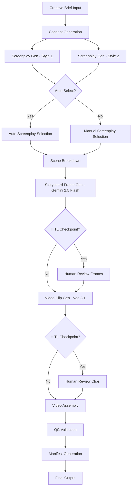

# Design Document: End-to-End Ad Video Generation

## Overview

This design extends the existing LangGraph-based ad storyboarding pipeline to produce complete 30-60 second advertisement videos. The system maintains the current StateGraph orchestration pattern while adding new nodes for scene breakdown, video generation with Veo 3.1, video assembly, quality control, and manifest generation.

**Key Design Principles:**
- Preserve existing LangGraph StateGraph architecture
- Maintain agent+tools pattern for each node
- Replace DALLE-3 with Gemini 2.5 Flash for image generation
- Add Veo 3.1 for video clip generation
- Use FFmpeg for video assembly and text overlays
- Implement robust error handling and retry logic
- Support both automatic and human-in-the-loop workflows

## Architecture

### High-Level Pipeline Flow



### LangGraph State Extension

The existing State TypedDict will be extended to support the new pipeline stages:

```python
from typing import TypedDict, Annotated, List, Dict, Optional
import operator

class Scene(TypedDict):
    scene_number: int
    duration_sec: float
    visual_description: str
    audio_description: str
    text_overlay: str

class StoryboardFrame(TypedDict):
    scene_number: int
    image_url: str
    prompt: str
    generation_timestamp: str

class VideoClip(TypedDict):
    scene_number: int
    video_url: str
    duration_sec: float
    generation_timestamp: str

class CreativeBrief(TypedDict):
    theme: str
    brand_name: str
    target_duration_sec: int  # 30 or 60
    aspect_ratio: str  # "16:9", "9:16", "1:1"
    platform: str  # "youtube", "instagram", "tiktok", etc.
    tone: Optional[str]
    target_audience: Optional[str]
    key_message: Optional[str]
    call_to_action: Optional[str]

class State(TypedDict):
    # Existing fields (preserved)
    theme: str
    concept: str
    screenplay_1: str
    screenplay_2: str
    screenplay_winner: str
    story_board: str
    overall_status: Annotated[str, operator.add]
    
    # New fields
    creative_brief: CreativeBrief
    auto_select_screenplay: bool
    scenes: List[Scene]
    storyboard_frames: List[StoryboardFrame]
    video_clips: List[VideoClip]
    final_video_url: str
    manifest_url: str
    qc_status: str
    safety_status: Annotated[str, operator.add]
```

## Components and Interfaces

### 0. Notebook Conversion (Task 0)

**Purpose:** Convert the existing Jupyter notebook to a Python module while preserving all code patterns

**Critical Preservation Requirements:**
- All existing node functions must be preserved exactly as they are
- All prompt templates must be preserved (see examples below)
- The agent+tools pattern must be maintained for all nodes
- The StateGraph setup and edge definitions must be preserved

**Existing Prompt Templates to Preserve:**

1. **Concept Creator Prompt:**
```python
concept_creator_prompt = """You are an intelligent advertisement concept creator for any given theme.
                    Your job is to generate a concept for the given theme and justify it.
                    Note: You can search over internet for the references but make sure the concept is fresh and novel."""
```

2. **Screenplay Writer Prompt (Rajamouli Style):**
```python
screenplay_writer_prompt = f"""#Context: You are an autonomous AI screenplay creation agent designed to create a screenplay for any given advertisement concept.

                    #Objective: Generate a unique, fresh, and novel screenplay for an advertisement concept.

                    #Guidelines:

                    1. Style and Inspiration:

                      - The screenplay should be influenced by the style of SS Rajamouli, a renowned Indian cinema director known for his epic storytelling, grand visuals, and emotional depth.
                      - Emulate the cinematic experience seen in Rajamouli's films, focusing on strong character development, dramatic plot twists, and visually captivating scenes.

                    2. Content Compliance:

                      - Ensure the screenplay adheres to all content guidelines and does not include any content violations.
                      - Avoid themes or depictions that could be considered offensive, inappropriate, or culturally insensitive.

                    3. Screenplay Structure:

                      - Title: [Provide a captivating title for the ad concept]
                      - Genre: [Specify the genre, e.g., fantasy, action, drama, etc.]
                      - Setting: Describe the primary locations and time periods where the story takes place.
                      - Characters: Introduce the main characters, detailing their roles, personalities, and relationships.
                      - Plot Overview: Provide a brief summary of the story arc, including the main conflict and resolution.
                      - Scenes: Outline the key scenes in the screenplay, ensuring a logical flow and narrative progression.
                      - Dialogue: Craft engaging and authentic dialogue that reflects the characters' personalities and advances the plot.

                    4. Scene Breakdown:

                      a. Opening Scene:

                        - Visuals: Describe the setting, atmosphere, and key visual elements.
                        - Action: Detail the actions and movements of characters within the scene.
                        - Camera Transition: Specify camera angles, movements, and transitions.
                        - Close-Up: Highlight any close-up shots that emphasize emotions or significant details.
                        - Text on Screen: Include any text that appears on screen, such as titles, captions, or subtitles.

                      b. Middle Scenes:
                        - Follow the same structure as the opening scene for each subsequent scene, ensuring continuity and coherence in the narrative.

                      c. Climactic Scene:
                        - Build up to the climax with heightened tension, dramatic reveals, and intense action.

                      d. Ending Scene:
                        - Resolve the main conflict, wrap up loose ends, and provide a satisfying conclusion.

                    Additional Notes:

                      - STRICTLY RESTRICT THE SCREENPLAY WITH IN 3500 Characters.
                      - Ensure the screenplay is engaging, emotionally resonant, and leaves a lasting impact on the audience.
                      - Maintain the color palette, mood, and character consistency throughout the screenplay.
                      - Incorporate Rajamouli's signature elements such as heroic feats, moral dilemmas, and visually stunning sequences.
                      - Ensure the screenplay is engaging, emotionally resonant, and leaves a lasting impact on the audience.

                    Given Theme: {state['theme']}
                    Given Concept: {state['concept']}"""
```

3. **Screenplay Writer Prompt (Shankar Style):**
```python
screenplay_writer_prompt = f"""#Context: You are an autonomous AI screenplay creation agent designed to create a screenplay for any given advertisement concept.

                    #Objective: Generate a unique, fresh, and novel screenplay for an advertisement concept.

                    #Guidelines:

                    1. Style and Inspiration:

                      - The screenplay should be influenced by the style of Shankar, a renowned Indian cinema director known for his grandiose visuals, intricate storytelling, and socially relevant themes.
                      -  The screenplay should reflect Shankar's cinematic experience, including high-impact visuals, compelling narratives, and dramatic sequences. Emphasize strong character development, elaborate sets, and emotional depth.

                    2. Content Compliance:

                      - Ensure the screenplay adheres to all content guidelines and does not include any content violations.
                      - Avoid themes or depictions that could be considered offensive, inappropriate, or culturally insensitive.

                    3. Screenplay Structure:

                      - Title: [Provide a captivating title for the ad concept]
                      - Genre: [Specify the genre, e.g., fantasy, action, drama, etc.]
                      - Setting: Describe the primary locations and time periods where the story takes place.
                      - Characters: Introduce the main characters, detailing their roles, personalities, and relationships.
                      - Plot Overview: Provide a brief summary of the story arc, including the main conflict and resolution.
                      - Scenes: Outline the key scenes in the screenplay, ensuring a logical flow and narrative progression.
                      - Dialogue: Craft engaging and authentic dialogue that reflects the characters' personalities and advances the plot.

                    4. Scene Breakdown:

                      a. Opening Scene:

                        - Visuals: Describe the setting, atmosphere, and key visual elements.
                        - Action: Detail the actions and movements of characters within the scene.
                        - Camera Transition: Specify camera angles, movements, and transitions.
                        - Close-Up: Highlight any close-up shots that emphasize emotions or significant details.
                        - Text on Screen: Include any text that appears on screen, such as titles, captions, or subtitles.

                      b. Middle Scenes:
                        - Follow the same structure as the opening scene for each subsequent scene, ensuring continuity and coherence in the narrative.

                      c. Climactic Scene:
                        - Build up to the climax with heightened tension, dramatic reveals, and intense action.

                      d. Ending Scene:
                        - Resolve the main conflict, wrap up loose ends, and provide a satisfying conclusion.

                    Additional Notes:

                      - STRICTLY RESTRICT THE SCREENPLAY WITH IN 3500 Characters.
                      - Ensure the screenplay is engaging, emotionally resonant, and leaves a lasting impact on the audience.
                      - Maintain the color palette, mood, and character consistency throughout the screenplay.
                      - Incorporate Shankar's signature elements such as grandiose visuals, intricate storytelling, and socially relevant themes.
                      - Ensure the screenplay is engaging, emotionally resonant, and leaves a lasting impact on the audience.

                    Given Theme: {state['theme']}
                    Given Concept: {state['concept']}"""
```

**Existing Node Pattern to Follow:**
```python
def ad_concept_creation_node(state):
    print("------ENTERING: CONCEPT CREATION NODE------")
    concept_creator_prompt = """..."""
    
    # Tool to perform web search
    internet_search_tool = get_tavily_search_retriever()
    tools = [internet_search_tool]
    concept_creator = create_web_search_agent(llm, tools, concept_creator_prompt, verbose = False)
    concept = concept_creator.invoke({"input": [HumanMessage(content=state['theme'])]})
    
    # Return dict with state updates
    return {"concept": concept['output']}
```

**All new nodes must follow this exact pattern:**
1. Print statement announcing node entry
2. Define prompt template as multi-line string
3. Create tools list
4. Create agent using `create_*_agent()` helper function
5. Invoke agent with state data
6. Return dict with state updates

### 1. Creative Brief Parser

**Purpose:** Parse and validate input creative brief

**Interface:**
```python
def parse_creative_brief(input_dict: Dict) -> CreativeBrief:
    """
    Parse and validate creative brief from input dictionary.
    
    Args:
        input_dict: Raw input containing creative brief parameters
        
    Returns:
        CreativeBrief: Validated creative brief object
        
    Raises:
        ValueError: If required fields are missing or invalid
    """
```

**Implementation Notes:**
- Validate target_duration_sec is 30 or 60
- Validate aspect_ratio is one of: "16:9", "9:16", "1:1", "4:5"
- Set default values for optional fields
- Populate State.creative_brief and State.theme

### 2. Scene Breakdown Node

**Purpose:** Convert screenplay into structured scenes with strict JSON schema

**Interface:**
```python
def scene_breakdown_node(state: State) -> Dict:
    """
    Break down screenplay into structured scenes.
    
    Args:
        state: Current pipeline state with screenplay_winner
        
    Returns:
        Dict containing 'scenes' key with List[Scene]
    """
```

**Implementation Notes:**
- Use LLM with structured output to generate scenes
- Enforce JSON schema validation
- For 30-second videos: generate 4-6 scenes
- For 60-second videos: generate 6-10 scenes
- Validate sum of scene durations equals target_duration_sec (±2 seconds)
- Each scene must have: scene_number, duration_sec, visual_description, audio_description, text_overlay

**Prompt Template:**
```
You are a scene breakdown specialist. Convert the following screenplay into {num_scenes} scenes.

Screenplay:
{screenplay_winner}

Target Duration: {target_duration_sec} seconds
Brand: {brand_name}

Generate scenes in strict JSON format:
[
  {
    "scene_number": 1,
    "duration_sec": 5.0,
    "visual_description": "Detailed visual description for image/video generation",
    "audio_description": "Audio/voiceover description",
    "text_overlay": "Text to display on screen"
  },
  ...
]

Requirements:
- Total duration must equal {target_duration_sec} seconds (±2 seconds)
- Each visual_description must be detailed enough for image generation
- Include brand name "{brand_name}" where appropriate
```

### 3. Storyboard Frame Generation Node (Gemini 2.5 Flash)

**Purpose:** Generate storyboard frames using Gemini 2.5 Flash

**Interface:**
```python
def storyboard_frame_generation_node(state: State) -> Dict:
    """
    Generate storyboard frames for each scene using Gemini 2.5 Flash.
    
    Args:
        state: Current pipeline state with scenes
        
    Returns:
        Dict containing 'storyboard_frames' key with List[StoryboardFrame]
    """
```

**Implementation Notes:**
- Replace DALLE-3 calls with Gemini 2.5 Flash API
- Generate one frame per scene
- Use scene.visual_description as the prompt
- Add brand name and style keywords to prompt
- Store generated images with metadata
- Implement retry logic for API failures

**Gemini 2.5 Flash Integration:**
```python
from google import genai
from google.genai import types

def generate_frame_with_gemini(prompt: str, aspect_ratio: str) -> str:
    """
    Generate image using Gemini 2.5 Flash.
    
    Args:
        prompt: Visual description for image generation
        aspect_ratio: Target aspect ratio
        
    Returns:
        str: URL or path to generated image
    """
    client = genai.Client(api_key=os.environ["GEMINI_API_KEY"])
    
    # Gemini 2.5 Flash uses generateText with image output
    response = client.models.generate_content(
        model="gemini-2.5-flash-image",
        contents=prompt,
        config=types.GenerateContentConfig(
            response_modalities=["image"],
            # Additional config for aspect ratio, quality, etc.
        )
    )
    
    # Extract image from response
    image_url = response.candidates[0].content.parts[0].inline_data
    return image_url
```

### 4. Video Clip Generation Node (Veo 3.1)

**Purpose:** Generate video clips for each scene using Veo 3.1

**Interface:**
```python
def video_clip_generation_node(state: State) -> Dict:
    """
    Generate video clips for each scene using Veo 3.1.
    
    Args:
        state: Current pipeline state with scenes and storyboard_frames
        
    Returns:
        Dict containing 'video_clips' key with List[VideoClip]
    """
```

**Implementation Notes:**
- Use Veo 3.1 API for video generation
- Generate one clip per scene
- Use scene.visual_description + scene.audio_description as prompt
- Provide corresponding storyboard_frame as reference image
- Respect scene.duration_sec (Veo 3.1 supports up to 8 seconds per clip)
- For scenes > 8 seconds, split into multiple clips
- Implement async generation with polling for completion

**Veo 3.1 Integration:**
```python
from google import genai
from google.genai import types
import time

def generate_video_with_veo(
    prompt: str,
    duration_sec: float,
    reference_image: str,
    aspect_ratio: str
) -> str:
    """
    Generate video clip using Veo 3.1.
    
    Args:
        prompt: Combined visual and audio description
        duration_sec: Target duration (max 8 seconds per clip)
        reference_image: URL to storyboard frame
        aspect_ratio: Target aspect ratio
        
    Returns:
        str: URL to generated video clip
    """
    client = genai.Client(api_key=os.environ["GEMINI_API_KEY"])
    
    # Start video generation job
    response = client.models.generate_video(
        model="veo-3.1",
        prompt=prompt,
        duration=min(duration_sec, 8.0),  # Veo 3.1 max is 8 seconds
        reference_image=reference_image,
        aspect_ratio=aspect_ratio,
        resolution="1080p"
    )
    
    # Poll for completion
    job_id = response.job_id
    while True:
        status = client.jobs.get(job_id)
        if status.state == "SUCCEEDED":
            return status.result.video_url
        elif status.state == "FAILED":
            raise Exception(f"Video generation failed: {status.error}")
        time.sleep(5)  # Poll every 5 seconds
```

### 5. Video Assembly Node

**Purpose:** Assemble video clips into final MP4 with text overlays and captions

**Interface:**
```python
def video_assembly_node(state: State) -> Dict:
    """
    Assemble video clips into final MP4 with text overlays.
    
    Args:
        state: Current pipeline state with video_clips and scenes
        
    Returns:
        Dict containing 'final_video_url' key
    """
```

**Implementation Notes:**
- Use FFmpeg for video processing
- Concatenate clips in scene_number order
- Add text overlays based on scene.text_overlay
- Generate captions from scene.audio_description
- Apply brand watermark if specified
- Output final MP4 with specified aspect_ratio

**FFmpeg Integration:**
```python
import subprocess
import json

def assemble_video_with_ffmpeg(
    video_clips: List[VideoClip],
    scenes: List[Scene],
    aspect_ratio: str,
    output_path: str
) -> str:
    """
    Assemble video clips using FFmpeg.
    
    Args:
        video_clips: List of generated video clips
        scenes: List of scene metadata
        aspect_ratio: Target aspect ratio
        output_path: Path for final video
        
    Returns:
        str: Path to assembled video
    """
    # Create concat file for FFmpeg
    concat_file = "concat_list.txt"
    with open(concat_file, "w") as f:
        for clip in sorted(video_clips, key=lambda x: x["scene_number"]):
            f.write(f"file '{clip['video_url']}'\n")
    
    # Build FFmpeg command with text overlays
    filter_complex = []
    for i, scene in enumerate(scenes):
        if scene["text_overlay"]:
            # Calculate start time for this scene
            start_time = sum(s["duration_sec"] for s in scenes[:i])
            end_time = start_time + scene["duration_sec"]
            
            # Add drawtext filter
            filter_complex.append(
                f"drawtext=text='{scene['text_overlay']}'"
                f":fontsize=48:fontcolor=white:x=(w-text_w)/2:y=(h-text_h)/2"
                f":enable='between(t,{start_time},{end_time})'"
            )
    
    # Concatenate and apply filters
    cmd = [
        "ffmpeg",
        "-f", "concat",
        "-safe", "0",
        "-i", concat_file,
        "-vf", ",".join(filter_complex) if filter_complex else "null",
        "-c:v", "libx264",
        "-preset", "medium",
        "-crf", "23",
        "-c:a", "aac",
        "-b:a", "192k",
        output_path
    ]
    
    subprocess.run(cmd, check=True)
    return output_path
```

### 6. QC Validation Node

**Purpose:** Validate generated video meets quality standards

**Interface:**
```python
def qc_validation_node(state: State) -> Dict:
    """
    Perform quality control validation on final video.
    
    Args:
        state: Current pipeline state with final_video_url
        
    Returns:
        Dict containing 'qc_status' key
    """
```

**Implementation Notes:**
- Check video duration matches target (±2 seconds)
- Verify all scenes have corresponding clips
- Validate aspect ratio
- Check video resolution (720p or 1080p)
- Verify audio track exists
- Return "QC_PASSED" or "QC_FAILED" with error details

### 7. Manifest Generation Node

**Purpose:** Generate manifest.json with complete lineage

**Interface:**
```python
def manifest_generation_node(state: State) -> Dict:
    """
    Generate manifest with complete pipeline lineage.
    
    Args:
        state: Complete pipeline state
        
    Returns:
        Dict containing 'manifest_url' key
    """
```

**Manifest Structure:**
```json
{
  "version": "1.0",
  "generated_at": "2025-01-15T10:30:00Z",
  "creative_brief": {
    "theme": "...",
    "brand_name": "...",
    "target_duration_sec": 30,
    "aspect_ratio": "16:9",
    "platform": "youtube"
  },
  "pipeline_stages": {
    "concept": {
      "timestamp": "2025-01-15T10:30:05Z",
      "output": "..."
    },
    "screenplay": {
      "timestamp": "2025-01-15T10:30:15Z",
      "style_1": "...",
      "style_2": "...",
      "winner": "style_1",
      "selection_method": "auto"
    },
    "scenes": [
      {
        "scene_number": 1,
        "duration_sec": 5.0,
        "visual_description": "...",
        "audio_description": "...",
        "text_overlay": "..."
      }
    ],
    "storyboard_frames": [
      {
        "scene_number": 1,
        "image_url": "...",
        "prompt": "...",
        "model": "gemini-2.5-flash-image",
        "timestamp": "2025-01-15T10:30:25Z"
      }
    ],
    "video_clips": [
      {
        "scene_number": 1,
        "video_url": "...",
        "duration_sec": 5.0,
        "model": "veo-3.1",
        "timestamp": "2025-01-15T10:31:00Z"
      }
    ],
    "final_video": {
      "url": "...",
      "duration_sec": 30.0,
      "aspect_ratio": "16:9",
      "resolution": "1080p",
      "timestamp": "2025-01-15T10:31:30Z"
    }
  },
  "qc_status": "PASSED",
  "safety_checks": {
    "concept": "PASSED",
    "screenplay": "PASSED",
    "frames": "PASSED",
    "clips": "PASSED"
  }
}
```

### 8. Safety Validation Module

**Purpose:** Check content for safety violations at each stage

**Interface:**
```python
def validate_safety(content: str, content_type: str) -> Dict:
    """
    Validate content for safety violations.
    
    Args:
        content: Content to validate (text, image URL, or video URL)
        content_type: Type of content ("text", "image", "video")
        
    Returns:
        Dict with 'passed' (bool) and 'violations' (List[str])
    """
```

**Implementation Notes:**
- Use Google Cloud Content Safety API or similar
- Check for: violence, hate speech, adult content, brand safety
- Return detailed violation reports
- Halt pipeline if violations detected

## Data Models

### Scene Schema

```python
{
  "scene_number": int,  # Sequential scene number (1-indexed)
  "duration_sec": float,  # Duration in seconds (e.g., 5.0)
  "visual_description": str,  # Detailed visual description for generation
  "audio_description": str,  # Audio/voiceover description
  "text_overlay": str  # Text to display on screen (can be empty)
}
```

### StoryboardFrame Schema

```python
{
  "scene_number": int,  # Links to Scene.scene_number
  "image_url": str,  # URL or path to generated image
  "prompt": str,  # Prompt used for generation
  "generation_timestamp": str  # ISO 8601 timestamp
}
```

### VideoClip Schema

```python
{
  "scene_number": int,  # Links to Scene.scene_number
  "video_url": str,  # URL or path to generated video
  "duration_sec": float,  # Actual duration of clip
  "generation_timestamp": str  # ISO 8601 timestamp
}
```

## Correctness Properties

*A property is a characteristic or behavior that should hold true across all valid executions of a system—essentially, a formal statement about what the system should do. Properties serve as the bridge between human-readable specifications and machine-verifiable correctness guarantees.*

Now I need to use the prework tool to analyze the acceptance criteria before writing the correctness properties:


### Property 1: Scene Count Based on Duration
*For any* creative brief with target_duration_sec of 30, the generated scenes list should contain between 4-6 scenes; for target_duration_sec of 60, the scenes list should contain between 6-10 scenes.
**Validates: Requirements 1.2, 1.3, 3.2, 3.3**

### Property 2: Scene Duration Sum Invariant
*For any* set of generated scenes, the sum of all scene.duration_sec values should equal the creative_brief.target_duration_sec within ±2 seconds tolerance.
**Validates: Requirements 3.5**

### Property 3: Scene Schema Compliance
*For any* generated scene, it must contain all required fields (scene_number, duration_sec, visual_description, audio_description, text_overlay) with correct types (int, float, str, str, str).
**Validates: Requirements 3.4**

### Property 4: Artifact Cardinality
*For any* completed pipeline execution, the number of storyboard_frames should equal the number of scenes, and the number of video_clips should equal the number of scenes.
**Validates: Requirements 4.2, 5.2**

### Property 5: Artifact-Scene Linkage
*For any* storyboard_frame or video_clip, its scene_number field must correspond to an existing scene in the scenes list.
**Validates: Requirements 4.4, 5.5**

### Property 6: Gemini API Usage
*For any* storyboard frame generation, the system should call the Gemini 2.5 Flash API (not DALLE-3) with the scene's visual_description as the prompt.
**Validates: Requirements 4.1, 4.3**

### Property 7: Veo API Parameters
*For any* video clip generation, the Veo 3.1 API call should include the scene's visual_description, duration_sec, and corresponding storyboard_frame URL as inputs.
**Validates: Requirements 5.3**

### Property 8: Aspect Ratio Preservation
*For any* creative brief with a specified aspect_ratio, all generated video_clips and the final_video should have that same aspect_ratio.
**Validates: Requirements 5.4, 6.4**

### Property 9: Video Clip Ordering
*For any* video assembly operation, video clips should be concatenated in ascending scene_number order.
**Validates: Requirements 6.1**

### Property 10: Text Overlay Presence
*For any* scene with a non-empty text_overlay field, the final video should contain that text rendered during the scene's time interval.
**Validates: Requirements 6.2**

### Property 11: QC Validation Completeness
*For any* QC validation, the system should check: (1) total duration matches target_duration_sec (±2 seconds), (2) all scenes have corresponding video clips, and (3) aspect_ratio matches the creative brief.
**Validates: Requirements 7.1, 7.2, 7.3**

### Property 12: QC Status Marking
*For any* QC validation that fails, overall_status should be marked "QC_FAILED"; for any QC validation that passes, overall_status should be marked "QC_PASSED".
**Validates: Requirements 7.4, 7.5**

### Property 13: Manifest Completeness
*For any* generated manifest, it should include: (1) complete creative brief, (2) all generated artifacts (concept, screenplays, scenes, frames, clips, final_video), (3) timestamps for each processing step, and (4) model versions (Gemini 2.5 Flash, Veo 3.1).
**Validates: Requirements 8.1, 8.2, 8.3, 8.4**

### Property 14: State Schema Extension
*For any* pipeline execution, the State TypedDict should contain all new fields (creative_brief, auto_select_screenplay, scenes, storyboard_frames, video_clips, final_video_url, manifest_url, qc_status, safety_status) and all existing fields (theme, concept, screenplay_1, screenplay_2, screenplay_winner, story_board, overall_status).
**Validates: Requirements 11.1, 11.2**

### Property 15: State Validation at Transitions
*For any* node transition in the pipeline, the State structure should be validated to ensure all required fields for that stage are present and correctly typed.
**Validates: Requirements 11.5**

### Property 16: Transient Error Retry
*For any* node that encounters a transient error (API timeout, rate limit), the system should retry the operation up to 3 times with exponential backoff before failing.
**Validates: Requirements 12.1**

### Property 17: Permanent Error Handling
*For any* node that encounters a permanent error (invalid input, safety violation), the system should halt processing immediately, log the error, and update overall_status with error details.
**Validates: Requirements 12.2, 12.3**

### Property 18: Partial State Preservation
*For any* pipeline execution that encounters an error, all successfully completed stages should have their results preserved in the State.
**Validates: Requirements 12.4**

### Property 19: Safety Violation Handling
*For any* safety validation that detects violations, the system should halt processing and log the violation details.
**Validates: Requirements 10.5**

### Property 20: Input Validation
*For any* creative brief input, the system should accept it if all required fields (theme, brand_name, target_duration_sec, aspect_ratio, platform) are present and target_duration_sec is either 30 or 60; otherwise, it should reject the input with a clear error message.
**Validates: Requirements 1.1, 1.5**

### Property 21: Optional Field Incorporation
*For any* creative brief with optional fields (tone, target_audience, key_message, call_to_action), the generated content (concept, screenplay, scenes) should reference or incorporate those fields.
**Validates: Requirements 1.4**

### Property 22: Backward Compatibility
*For any* pipeline execution, the existing nodes (ad_concept_creation_node, screen_play_creation_in_rajamouli_style, screen_play_creation_in_shankar_style) should execute and produce their expected outputs (concept, screenplay_1, screenplay_2).
**Validates: Requirements 2.1, 2.2**

### Property 23: Auto Screenplay Selection
*For any* pipeline execution with auto_select_screenplay enabled, a screenplay_winner should be selected automatically without requiring human input.
**Validates: Requirements 2.3**

## Error Handling

### Error Categories

1. **Transient Errors** (retry with exponential backoff):
   - API timeouts
   - Rate limits
   - Network failures
   - Temporary service unavailability

2. **Permanent Errors** (halt immediately):
   - Invalid input format
   - Safety violations
   - Missing required fields
   - Schema validation failures
   - Authentication failures

3. **Partial Failures** (continue with degradation):
   - Optional field processing errors
   - Non-critical validation warnings

### Retry Strategy

```python
import time
from typing import Callable, Any

def retry_with_backoff(
    func: Callable,
    max_retries: int = 3,
    base_delay: float = 1.0,
    max_delay: float = 60.0
) -> Any:
    """
    Retry function with exponential backoff.
    
    Args:
        func: Function to retry
        max_retries: Maximum number of retry attempts
        base_delay: Initial delay in seconds
        max_delay: Maximum delay in seconds
        
    Returns:
        Result of successful function call
        
    Raises:
        Exception: If all retries exhausted
    """
    for attempt in range(max_retries):
        try:
            return func()
        except TransientError as e:
            if attempt == max_retries - 1:
                raise
            delay = min(base_delay * (2 ** attempt), max_delay)
            time.sleep(delay)
        except PermanentError:
            raise  # Don't retry permanent errors
```

### Error Logging

All errors should be logged with:
- Timestamp
- Node name
- Error type (transient/permanent)
- Error message
- Stack trace
- Current State snapshot

## Testing Strategy

### Dual Testing Approach

The system will use both unit tests and property-based tests for comprehensive coverage:

**Unit Tests:**
- Specific examples of valid creative briefs
- Edge cases (exactly 30 seconds, exactly 60 seconds)
- Error conditions (invalid duration, missing fields)
- Integration points between nodes
- FFmpeg command generation
- API call mocking

**Property-Based Tests:**
- Universal properties across all inputs
- Randomized creative brief generation
- Scene generation with varying parameters
- State validation across all node transitions
- Error handling with injected failures

**Property Test Configuration:**
- Minimum 100 iterations per property test
- Each test tagged with: **Feature: end-to-end-ad-video-generation, Property {number}: {property_text}**
- Use hypothesis (Python) for property-based testing
- Generate random but valid inputs for each test

**Example Property Test:**
```python
from hypothesis import given, strategies as st
import pytest

@given(
    target_duration=st.sampled_from([30, 60]),
    theme=st.text(min_size=10, max_size=100),
    brand_name=st.text(min_size=3, max_size=50)
)
@pytest.mark.property_test
def test_scene_count_based_on_duration(target_duration, theme, brand_name):
    """
    Feature: end-to-end-ad-video-generation, Property 1: Scene Count Based on Duration
    
    For any creative brief with target_duration_sec of 30, the generated scenes 
    list should contain between 4-6 scenes; for target_duration_sec of 60, 
    the scenes list should contain between 6-10 scenes.
    """
    creative_brief = {
        "theme": theme,
        "brand_name": brand_name,
        "target_duration_sec": target_duration,
        "aspect_ratio": "16:9",
        "platform": "youtube"
    }
    
    state = run_pipeline_to_scene_breakdown(creative_brief)
    scene_count = len(state["scenes"])
    
    if target_duration == 30:
        assert 4 <= scene_count <= 6
    else:  # target_duration == 60
        assert 6 <= scene_count <= 10
```

### Integration Testing

- Test complete pipeline end-to-end with mock APIs
- Test HITL checkpoints with simulated user input
- Test error recovery and retry logic
- Test safety validation with known unsafe content
- Test manifest generation with complete pipeline execution

### Performance Testing

- Measure end-to-end pipeline latency
- Test concurrent pipeline executions
- Monitor API rate limits and quotas
- Test video assembly performance with varying clip counts

## Deployment Considerations

### Environment Variables

```bash
# API Keys
GEMINI_API_KEY=<your-gemini-api-key>
GOOGLE_CLOUD_PROJECT=<your-project-id>

# Configuration
MAX_RETRIES=3
RETRY_BASE_DELAY=1.0
RETRY_MAX_DELAY=60.0
ENABLE_HITL_CHECKPOINTS=false
ENABLE_SAFETY_CHECKS=true

# Storage
OUTPUT_DIR=/path/to/output
TEMP_DIR=/path/to/temp
```

### Dependencies

```
langgraph>=0.2.0
langchain>=0.3.0
google-genai>=0.8.0
ffmpeg-python>=0.2.0
hypothesis>=6.0.0  # For property-based testing
pydantic>=2.0.0  # For schema validation
```

### Infrastructure Requirements

- Python 3.10+
- FFmpeg installed on system
- Sufficient disk space for video storage (estimate 100MB per 30-second video)
- Network access to Google AI APIs
- Optional: GPU for faster video processing

## Future Enhancements

1. **Multi-language Support**: Generate videos in multiple languages
2. **Voice-over Generation**: Add AI-generated voice-overs using text-to-speech
3. **Music Integration**: Add background music selection and mixing
4. **Advanced Editing**: Support for transitions, effects, and color grading
5. **Batch Processing**: Generate multiple video variants in parallel
6. **A/B Testing**: Generate multiple versions for testing
7. **Analytics Integration**: Track video performance metrics
8. **Template Library**: Pre-built templates for common ad types
9. **Brand Guidelines**: Enforce brand-specific visual guidelines
10. **Export Formats**: Support for multiple output formats (MP4, WebM, GIF)
