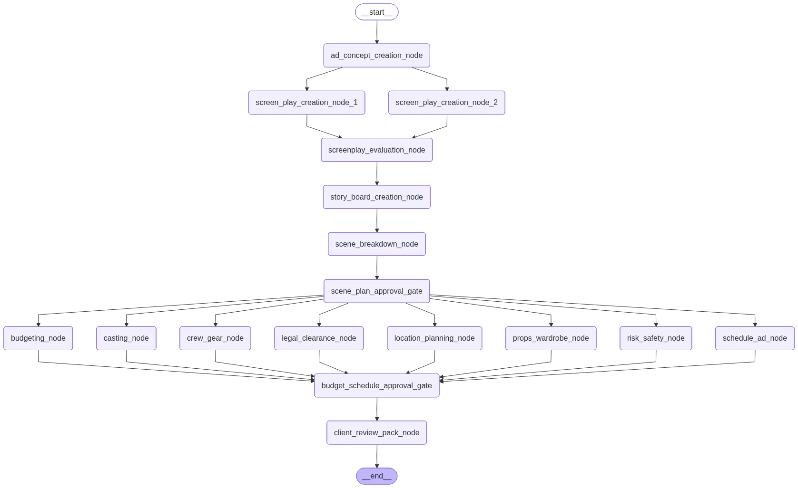
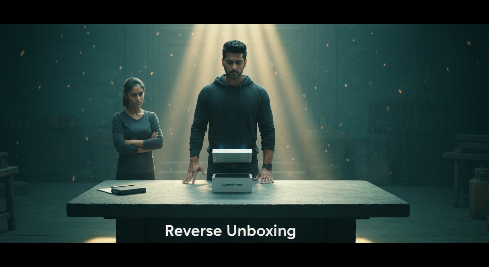
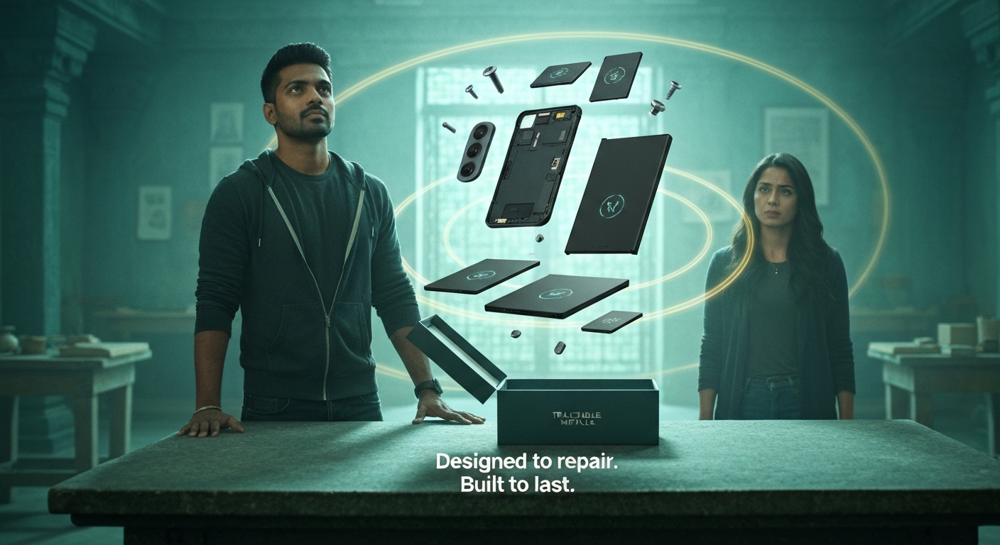
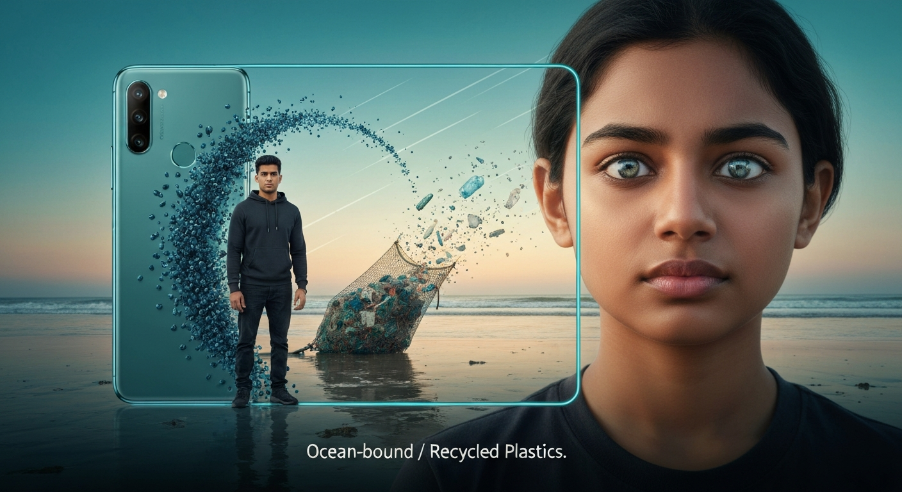
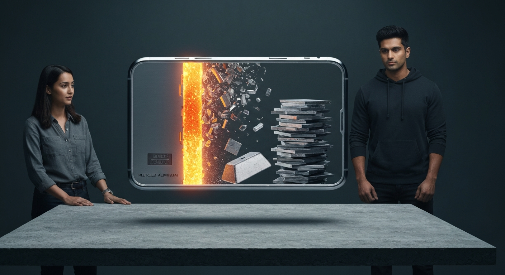
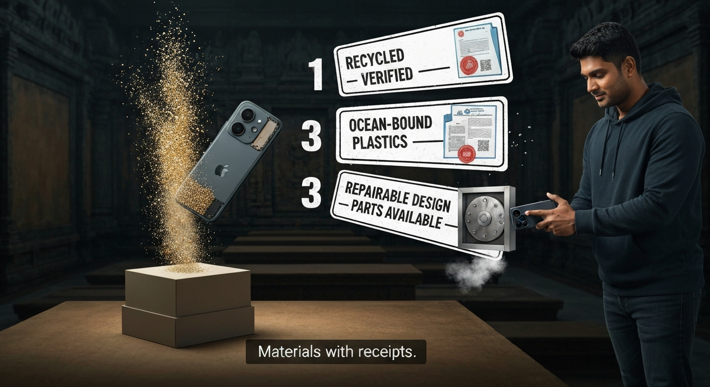
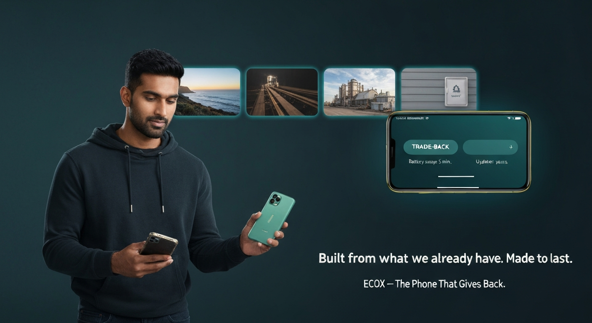

# Virtual Ad Agency - AI-Powered Ad Production Platform

An AI-powered platform for generating ad campaigns from brief to production pack, using **multi-agent LangGraph architecture** with TAMUS (GPT-5.2) for text generation and Gemini for image generation.

## Features

- **Project Management** - Create and manage ad campaign projects
- **Brief Submission** - Define campaign parameters (platform, duration, budget, creative direction)
- **AI Concept Generation** - Generate creative concepts using TAMUS GPT-5.2
- **Screenplay Generation** - Create 2 screenplay variants (Rajamouli & Shankar styles) with 6 scenes each
- **Storyboard Creation** - Generate detailed storyboards with AI-generated images
- **Character Consistency** - Maintain consistent character appearance across all scenes
- **Production Pack** - Automated scene breakdown, crew, location planning, legal clearances, and risk assessment
- **Video Generation Ready** - Structured output compatible with video generation models (Runway, Pika, Sora) for automatic video creation

## Architecture

### Multi-Agent LangGraph Workflow

The platform uses **LangGraph** to orchestrate a multi-agent workflow for ad production. The workflow consists of specialized agents that collaborate to transform a creative brief into a complete production pack.

#### Creative Chain (Sequential)

```
start → concept_creation → screenplay_1 (Rajamouli) ⟍
                         → screenplay_2 (Shankar)  ⟋ → evaluation → storyboard → scene_breakdown
```

#### Production Planning (Parallel)

```
scene_plan_approval → ⟨ budgeting
                      ⟨ casting
                      ⟨ crew_gear
                      ⟨ legal_clearance
                      ⟨ location_planning
                      ⟨ props_wardrobe
                      ⟨ risk_safety
                      ⟨ schedule_planning ⟩ → budget_schedule_approval → client_review_pack → end
```

### Agent Nodes

| Node | Purpose | Output |
|------|---------|--------|
| **ad_concept_creation_node** | Generate creative concept from brief | Concept description |
| **screen_play_creation_node_1** | Generate Rajamouli-style screenplay (epic, grand scale) | Screenplay variant A |
| **screen_play_creation_node_2** | Generate Shankar-style screenplay (high-tech, futuristic) | Screenplay variant B |
| **screenplay_evaluation_node** | Human-in-the-loop screenplay selection | Selected screenplay |
| **story_board_creation_node** | Generate storyboard with Gemini images | Storyboard frames |
| **scene_breakdown_node** | Break down storyboard into structured scenes | Scene plan with shots |
| **location_planning_node** | Generate location requirements and permits | Locations plan |
| **budgeting_node** | Generate budget estimate with line items | Budget estimate |
| **schedule_ad_node** | Generate shoot schedule with company moves | Schedule plan |
| **casting_node** | Generate casting suggestions | Casting breakdown |
| **props_wardrobe_node** | Generate props and wardrobe list | Props/wardrobe list |
| **crew_gear_node** | Generate crew and equipment recommendations | Crew/gear package |
| **legal_clearance_node** | Generate legal clearances checklist | Legal clearance report |
| **risk_safety_node** | Generate risk register with mitigation | Risk register |
| **client_review_pack_node** | Consolidate all artifacts into production pack | Production pack (markdown) |

### Key Features

- **Parallel Execution**: Production planning nodes run in parallel for faster generation
- **Human-in-the-Loop (HITL)**: Screenplay selection and approval gates
- **Tavily Search Integration**: All creative agents powered by web search for up-to-date context
- **Synthetic Fallbacks**: Graceful degradation with synthetic data on API timeouts
- **Reasoning Token Support**: Increased max_tokens (6000-8000) to accommodate GPT-5.2 reasoning tokens

### Workflow Diagram



The workflow consists of:
- **Sequential Creative Chain**: Concept → Screenplays (2 variants) → Evaluation → Storyboard → Scene Breakdown
- **Parallel Production Planning**: 8 agents run concurrently (budgeting, casting, crew/gear, legal, locations, props/wardrobe, risk/safety, scheduling)
- **Human-in-the-Loop Gates**: Screenplay evaluation and approval checkpoints
- **Final Consolidation**: Client review pack generation

## Example Output: GreenPhone Campaign

The platform generated a complete 30-second advertisement campaign for "GreenPhone" - an eco-friendly smartphone brand. Below are the AI-generated storyboard frames showcasing the multi-agent workflow in action.

### Campaign Brief
- **Brand:** GreenPhone (sustainable smartphone)
- **Theme:** "The Phone That Gives Back" - Built from recycled materials
- **Duration:** 30 seconds
- **Platform:** YouTube
- **Creative Direction:** Epic tech-fantasy style with environmental message

### Generated Storyboard Frames

#### Scene 1: Reverse Unboxing (5s)
*"Not an upgrade. A repayment."*



Dim temple-like workshop. A sleek phone box sits on a stone table with sanctum-like light shafts. The protagonist places his palm on the box as the lid lifts unnaturally, as if pulled by rewinding time.

---

#### Scene 2: Modular Design (6s)
*"Designed to repair. Built to last."*



The phone rises above the box, hovering. Micro-screws spin out in reverse motion. Modules separate cleanly: screen, battery, camera, and frame, arranged like a sacred constellation. Close-up reveals "TRACEABLE METALS" engraved on the frame.

---

#### Scene 3: Ocean-Bound Plastics (6s)
*"What was taken from the tide… returns as purpose."*



Match-cut from phone's back panel to plastic pellets. Time rewinds: fragments fly out of a cleanup net and rejoin the sea. The coast transforms from littered to pristine at dawn.

---

#### Scene 4: Recycled Aluminum (5s)
*"Strength doesn't need new scars."*



Macro shot of the phone's aluminum edge. The metal un-forges in reverse: pristine frame to molten glow, to cleaned scrap stacks. Scrap rises, purifies, compresses into a perfect ingot, then snaps back into the phone frame.

---

#### Scene 5: Material Verification (5s)
*"Truth shouldn't be marketed. It should be shown."*



The camera module blooms into shimmering grains that stream into a modern supply-chain vault. Three bold "passport" stamps slam down: RECYCLED METALS, OCEAN-BOUND PLASTICS, REPAIRABLE DESIGN. Modules reassemble with a heroic CLICK.

---

#### Scene 6: The Phone That Gives Back (3s)
*"Built from what we already have. Made to last."*



The intact phone rests in the protagonist's hand. Behind them, calm flashes of the coast, foundry, and vault fade into warm light. The phone screen shows "TRADE-BACK + TRACK-BACK" UI with "Battery swap: 5 min" and "Updates: years".

---

### Campaign Results

**Generated by Multi-Agent LangGraph Workflow:**
- ✅ Creative concept with environmental storytelling
- ✅ 2 screenplay variants (Rajamouli epic style selected)
- ✅ 6 cinematic storyboard frames with consistent characters
- ✅ Complete production pack with scene breakdown, locations, crew, legal clearances, and risk assessment
- ⏱️ Total generation time: ~90 seconds

**Key Features Demonstrated:**
- **Character Consistency:** Same protagonist (28-year-old South Asian male, charcoal hoodie) across all scenes
- **Visual Continuity:** Consistent color palette (deep teal, warm gold, charcoal shadows)
- **Narrative Flow:** Reverse-time storytelling showing phone's sustainable journey
- **Brand Message:** Clear environmental impact and repairability focus

---

## Tech Stack

### Backend
- **FastAPI** - REST API server
- **LangGraph** - Multi-agent workflow orchestration
- **TAMUS API** - GPT-5.2 for text generation (with reasoning tokens)
- **Gemini API** - Imagen 4.0 for image generation
- **Tavily API** - Web search for creative context
- **Python 3.9+**

### Frontend
- **Next.js 15** - React framework
- **TypeScript** - Type-safe development
- **Tailwind CSS v4** - Styling
- **shadcn/ui** - UI components
- **React Query** - Data fetching and caching
- **Framer Motion** - Animations

## Quick Start

### Prerequisites

- Python 3.9+
- Node.js 18+
- TAMUS API key
- Gemini API key (optional, for images)

### 1. Environment Setup

Create `.env` file in project root:

```bash
# TAMUS API (required for text generation)
USE_TAMUS_API=true
TAMUS_API_KEY=your_tamus_api_key_here
TAMUS_API_URL=https://chat-api.tamu.ai
TAMUS_MODEL=protected.gpt-5.2
TAMUS_API_DELAY=3

# Gemini API (required for image generation)
GEMINI_API_KEY=your_gemini_api_key_here

# Tavily Search API (required for web-enhanced creative generation)
TAVILY_API_KEY=your_tavily_api_key_here

# LangGraph Workflow (enable multi-agent architecture)
USE_LANGGRAPH=true
```

### 2. Start Backend

```bash
cd backend
pip install -r requirements.txt
python main.py
```

Backend runs on: **http://localhost:2501**

### 3. Start Frontend

```bash
cd virtual-ad-agency-ui
npm install
npm run dev
```

Frontend runs on: **http://localhost:2500**

### 4. Open Application

Open your browser: **http://localhost:2500**

## Workflow

1. **Create Project** - Name, client, budget band, tags
2. **Submit Brief** - Platform, duration, budget, creative direction, target audience
3. **Generate Concept** - AI generates creative concept with web search context (10-30s)
4. **Generate Screenplays** - AI creates 2 screenplay variants with Tavily search:
   - **Variant A**: Rajamouli style (epic, grand scale, sweeping cinematography)
   - **Variant B**: Shankar style (high-tech, futuristic, innovative camera work)
5. **Select Screenplay** - Choose preferred variant (HITL gate)
6. **Generate Storyboard** - AI creates detailed storyboard with Gemini-generated images (30-60s)
7. **Generate Production Pack** - Multi-agent parallel generation (60-90s):
   - Scene breakdown with shots
   - Location planning with permits
   - Crew requirements
   - Legal clearances
   - Risk assessment
8. **Export** - Download production documents

## API Endpoints

### Projects
- `GET /api/projects` - List all projects
- `POST /api/projects` - Create new project
- `GET /api/projects/{id}` - Get project details
- `PATCH /api/projects/{id}` - Update project
- `DELETE /api/projects/{id}` - Delete project

### Brief
- `POST /api/projects/{id}/brief` - Submit brief

### Generation
- `POST /api/projects/{id}/generate/concept` - Generate concept
- `POST /api/projects/{id}/generate/screenplays` - Generate screenplays
- `POST /api/projects/{id}/generate/storyboard` - Generate storyboard
- `POST /api/projects/{id}/generate/production` - Generate production pack

### Selection
- `POST /api/projects/{id}/select/screenplay` - Select screenplay

### Jobs
- `GET /api/jobs/{id}` - Get job status

## Project Structure

```
.
├── backend/                    # FastAPI backend
│   ├── main.py                # Main API server
│   ├── ad_workflow.py         # LangGraph workflow definition
│   ├── output_formatter.py    # LLM output parsing and formatting
│   ├── requirements.txt       # Python dependencies
│   └── output/                # Generated files
├── virtual-ad-agency-ui/      # Next.js frontend
│   ├── app/                   # Next.js app directory
│   ├── components/            # React components
│   ├── contexts/              # React contexts
│   ├── hooks/                 # Custom hooks
│   ├── lib/                   # Utilities and API client
│   └── package.json           # Node dependencies
├── models/                    # Pydantic data models
│   ├── scene_plan.py         # Scene and shot models
│   ├── locations_plan.py     # Location requirements
│   ├── budget_estimate.py    # Budget line items
│   ├── schedule_plan.py      # Shoot schedule
│   ├── crew_gear.py          # Crew and equipment
│   ├── legal_clearance.py    # Legal requirements
│   └── risk_register.py      # Risk assessment
├── ad_production_pipeline.py  # Production planning pipeline
├── tamus_wrapper.py          # TAMUS API client
├── .env                      # Environment variables
└── README.md                 # This file
```

## Development

### Backend Development

```bash
cd backend
python main.py
```

API documentation available at: **http://localhost:2501/docs**

### Frontend Development

```bash
cd virtual-ad-agency-ui
npm run dev
```

### Type Checking

```bash
cd virtual-ad-agency-ui
npm run type-check
```

### Linting

```bash
cd virtual-ad-agency-ui
npm run lint
```

## Environment Variables

### Required

- `TAMUS_API_KEY` - TAMUS API key for GPT-5.2
- `TAMUS_API_URL` - TAMUS API base URL
- `TAMUS_MODEL` - TAMUS model name (protected.gpt-5.2)
- `GEMINI_API_KEY` - Gemini API key for image generation
- `TAVILY_API_KEY` - Tavily API key for web search

### Optional

- `USE_LANGGRAPH` - Enable LangGraph workflow (default: true)
- `USE_TAMUS_API` - Enable TAMUS API (default: true)
- `TAMUS_API_DELAY` - Delay between API calls in seconds (default: 3)
- `OUTPUT_DIR` - Output directory for generated files (default: `./output`)
- `TEMP_DIR` - Temporary directory (default: `./temp`)
- `QUIET_MODE` - Reduce verbose logging (default: false)

## Performance

| Operation | Expected Time | Notes |
|-----------|--------------|-------|
| Concept Generation | 10-30 seconds | With Tavily search |
| Screenplay Generation | 15-40 seconds | 2 variants with web context |
| Storyboard Generation | 30-60 seconds | 6 scenes with Gemini images |
| Production Pack | 60-90 seconds | Parallel agent execution |

### Performance Optimizations

- **Parallel Execution**: Production planning nodes run concurrently
- **Increased Token Limits**: 6000-8000 max_tokens for reasoning models
- **Synthetic Fallbacks**: Graceful degradation on API timeouts (300s timeout)
- **Multi-part Response Parsing**: Robust Gemini image extraction
- **Rate Limiting**: 3-second delays between API calls

## Features Status

### ✅ Implemented
- Multi-agent LangGraph workflow
- Project management (CRUD)
- Brief submission with validation
- Concept generation with Tavily search
- Screenplay generation (2 variants: Rajamouli & Shankar styles)
- Screenplay selection (HITL gate)
- Storyboard generation with Gemini images
- Production pack generation (parallel agents)
- Scene breakdown with shots
- Location planning with permits
- Crew requirements
- Legal clearances
- Risk assessment
- Job status polling with SSE
- Error handling with synthetic fallbacks
- Progress tracking
- Reasoning token support (GPT-5.2)

### ⏳ In Progress
- Export functionality (PDF/ZIP)
- Scene regeneration

### 📋 Planned
- Content editing
- Collaboration features
- Version history
- Budget estimation (removed from UI)
- Schedule planning (removed from UI)
- Equipment list (removed from UI)

### 🎬 Future Scope: Video Generation Integration

**Storyboard-to-Video Pipeline**

The platform's structured storyboard output (with detailed scene descriptions, character consistency, and visual prompts) can be directly integrated with video generation models to create complete ad videos automatically.

**Benefits:**
- **Massive Cost Savings:** Traditional ad production costs $50K-$500K. AI video generation reduces this to $500-$5K (90-99% cost reduction)
- **Time Efficiency:** Production timeline drops from 4-8 weeks to 24-48 hours
- **Iteration Speed:** Generate multiple video variants instantly for A/B testing
- **Consistent Quality:** Character consistency and visual continuity maintained across all scenes

**Integration Approach:**

Given credits for any video generation model (Runway, Pika, Sora, etc.), the platform can:

1. **Parse Storyboard Data** → Extract scene descriptions, character references, and visual prompts
2. **Generate Video Clips** → Send each scene to video generation API with consistent character prompts
3. **Assemble Timeline** → Stitch clips with transitions, timing, and audio cues
4. **Export Final Video** → Render complete 30-60 second advertisement

**Example Workflow:**
```
Storyboard (6 scenes) → Video Generation Model → 6 video clips → Assembly → Final Ad Video
Time: 30-60 minutes | Cost: $5-$50 (vs $50K-$500K traditional)
```

**Cost & Time Comparison:**

| Method | Cost | Time | Iterations |
|--------|------|------|------------|
| **Traditional Production** | $50K - $500K | 4-8 weeks | 1-2 (expensive to redo) |
| **AI Video Generation** | $500 - $5K | 24-48 hours | Unlimited (instant variants) |
| **Savings** | **90-99% reduction** | **95% faster** | **Infinite flexibility** |

**Supported Video Models:**
- Runway Gen-3 Alpha
- Pika 1.5
- OpenAI Sora (when available)
- Google Veo
- Stability AI Stable Video Diffusion

**Technical Implementation:**
- API integration with video generation platforms
- Character reference image extraction from storyboard frames
- Automated prompt engineering for video consistency
- Timeline assembly with FFmpeg
- Audio sync and voiceover integration

This feature would complete the end-to-end pipeline: **Brief → Concept → Screenplay → Storyboard → Video → Final Ad**

## Troubleshooting

### Backend won't start

**Error:** `ModuleNotFoundError: No module named 'fastapi'`

**Solution:**
```bash
cd backend
pip install -r requirements.txt
```

### Frontend won't start

**Error:** `Cannot find module 'next'`

**Solution:**
```bash
cd virtual-ad-agency-ui
npm install
```

### Production pack shows empty data

**Issue:** Budget shows $0, schedule shows 0 days, locations show 0 locations

**Root Cause:** TAMUS API hitting token limit (reasoning tokens consuming all max_tokens)

**Solution:** Already fixed - increased max_tokens to 6000-8000 for production planning nodes

### Storyboard images not generating

**Issue:** Seeing "No inline_data in part" warnings

**Root Cause:** Gemini returns multi-part responses (text + image)

**Solution:** Already fixed - parser now scans all parts for image data

### Concept not showing

**Check:**
1. Backend logs - Is TAMUS API call succeeding?
2. Browser console - Is job status polling working?
3. Environment variables - Is TAMUS_API_KEY set?
4. LangGraph enabled - Is USE_LANGGRAPH=true?

**Debug:**
```bash
# Check backend logs
cd backend
python main.py

# Check browser console (F12 → Console)
# Look for "[Concept Generation]" logs
```

### "Project not found" error

**Solution:**
1. Restart both servers
2. Clear browser cache
3. Create new project

### API timeout errors

**Issue:** Production pipeline timing out at location planning

**Solution:** Already fixed - increased timeout from 120s to 300s (5 minutes)

## License

MIT

## Support

For issues or questions, please check the documentation or create an issue in the repository.

## Credits

Built with:
- [LangGraph](https://langchain-ai.github.io/langgraph/) - Multi-agent workflow orchestration
- [FastAPI](https://fastapi.tiangolo.com/) - Modern Python web framework
- [Next.js](https://nextjs.org/) - React framework
- [TAMUS API](https://chat-api.tamu.ai/) - GPT-5.2 with reasoning tokens
- [Google Gemini](https://ai.google.dev/) - Imagen 4.0 for image generation
- [Tavily](https://tavily.com/) - AI-powered web search
- [shadcn/ui](https://ui.shadcn.com/) - Beautiful UI components
- [Tailwind CSS](https://tailwindcss.com/) - Utility-first CSS framework

## Documentation

- [LangGraph Flow Explained](docs/LANGGRAPH_FLOW_EXPLAINED.md) - Detailed workflow documentation
- [LangGraph Code Example](docs/LANGGRAPH_CODE_EXAMPLE.md) - Implementation examples
- [Production Pipeline Fix](docs/PRODUCTION_PIPELINE_JSON_PARSING_FIX.md) - Token limit fix
- [Gemini Image Parser Fix](docs/GEMINI_IMAGE_PARSER_FIX.md) - Multi-part response handling
- [Quickstart Guide](docs/QUICKSTART.md) - Quick setup instructions
